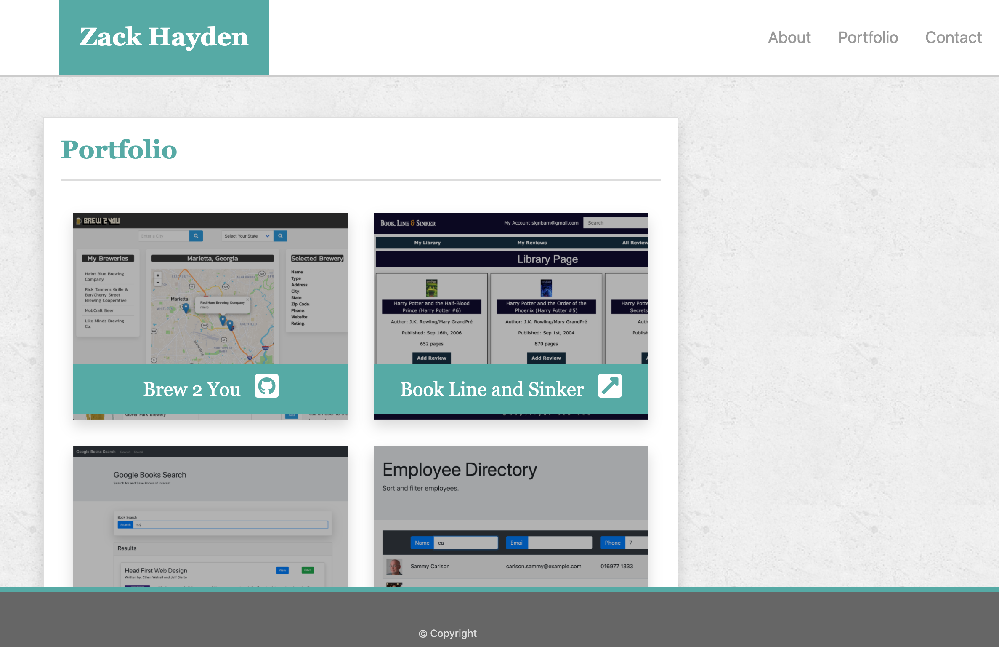

# react-portfolio
[](http://unlicense.org/)

## Description

This is my portfolio page ported to React

## Table of Contents

* [Installation](#installation)

* [Usage](#usage)

* [License](#license)

* [Contributing](#contributing)

* [Screenshot](#screenshot)

* [Links](#links)

* [Questions](#questions)

## Installation

To install the necessary dependencies, run the following command:

```
npm install
```

## Usage

This really isn't *for* you, but if you want to clone it and try it out or use it as a template for your own portfolio, be my guest.

## License

This project is licensed under the None license.

## Contributing

I'll accept PRs for bug fixes.

## Screenshot



## Links

* [GitHub Repository](https://github.com/zackapotamus/react-portfolio)

* [GitHub Hosted Page](https://zackapotamus.github.io/react-portfolio)

## Questions


If you have any questions about the repo, open an issue or contact [zackapotamus](https://api.github.com/users/zackapotamus) at [zack.hayden@gmail.com](mailto:zack.hayden@gmail.com).

